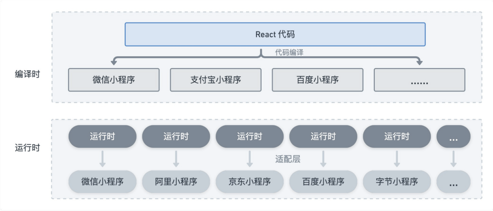
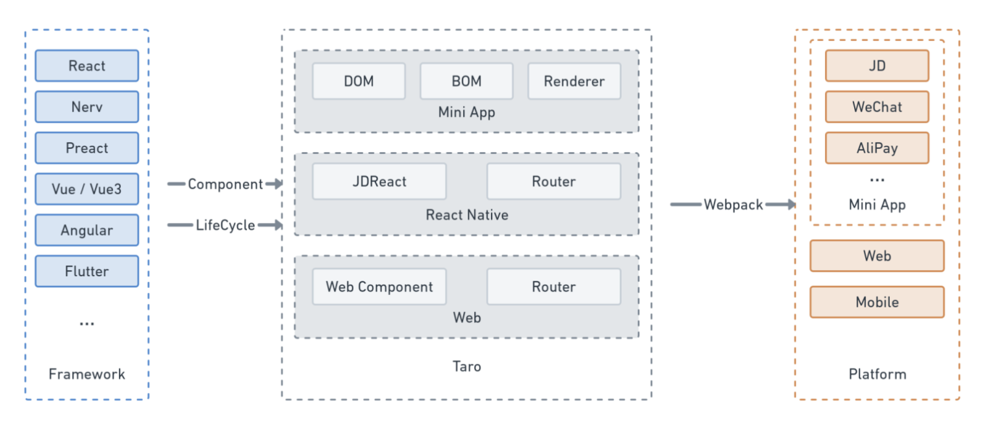
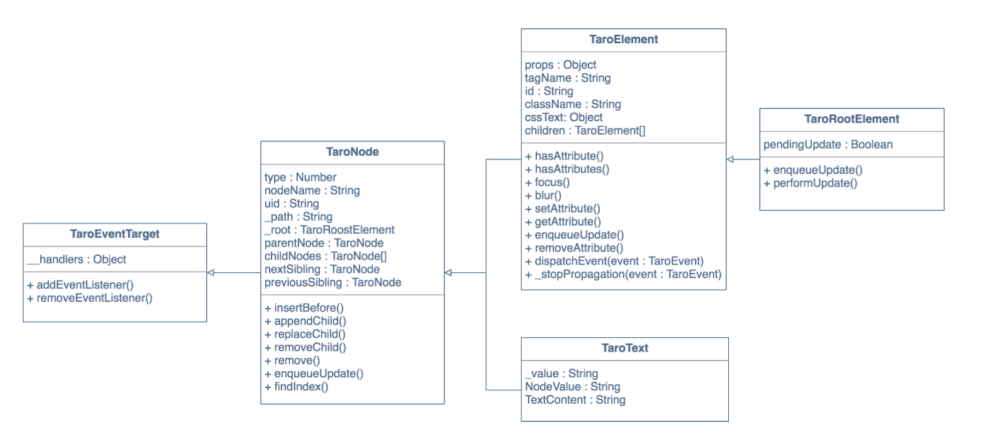
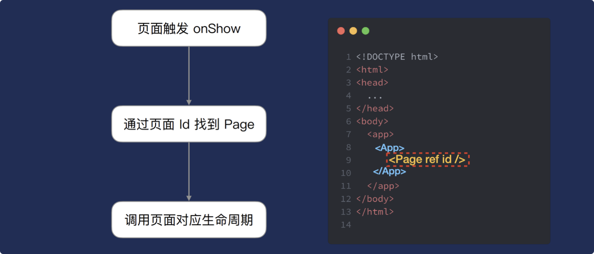
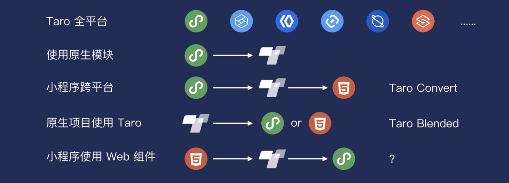
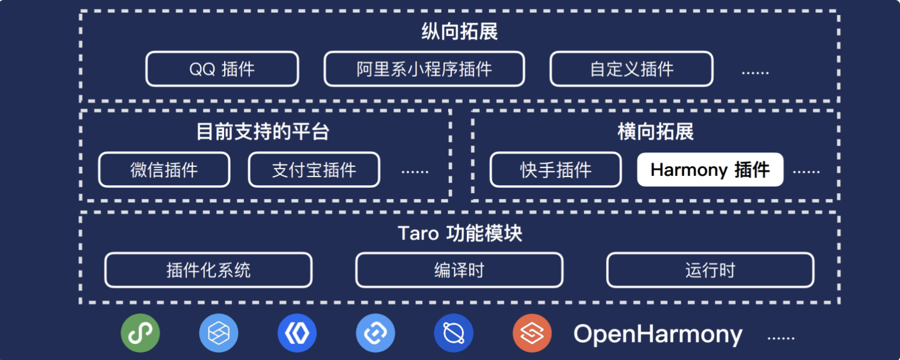
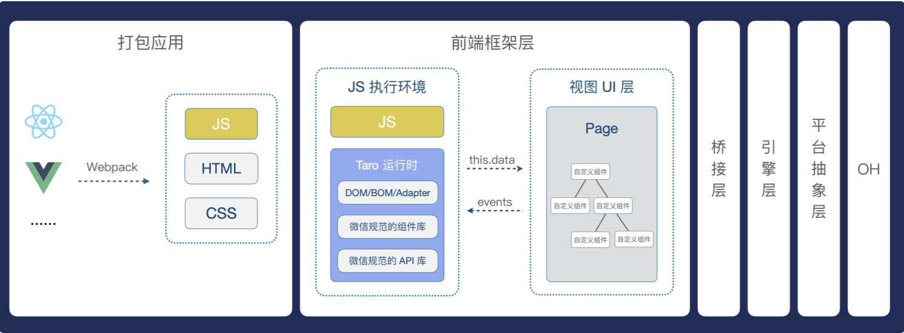

演讲大纲
----

1.  我们需要一个怎样的多端解决方案
2.  高拓展性的开放式架构
3.  小程序和 H5 的生态融合
4.  鸿蒙带来的机遇和挑战

演讲内容
----

### 1\. 我们需要一个怎样的多端解决方案

#### 1.1 小程序生态共荣

越来越多的小程序平台，不仅带来了更多产品发布的渠道，反过来也促进了小程序与应用生态共建。

#### 1.2 开发体验和性能

*   多框架支持
*   性能优化

*   插件化

#### 1.3 面向开放、开源社区、开发者

Taro 提供了一个开放式的跨端跨框架解决方案，允许不同技术栈、不同生态的开发者参与到使用和建设框架的过程中来。

  

### 2\. 高拓展性的开放式架构

Taro 基本架构：

  

Taro 3.x 插件化架构：

  

Taro运行时：

  

生命周期：

### 3\. 小程序和H5的生态融合

#### 3.1 代码转换

Taro提供了代码转换工具，支持以下转换：

#### 3.2 支持直接使用 html 标签开发

基于 @tarojs/plugin-html 实现标签名、属性、事件映射，进而支持直接使用 web 端 UI 库，如 Antd-mobile、WeUI、Vant 等

  

### 4\. 鸿蒙带来的机遇和挑战

  

OpenHarmony 的 JS UI 语法和⼩程序语法相近，所以适配是可行的，taro 在 2021.12.09 已经发布了 v3.5.0-canary.0 版本，支持适配鸿蒙。

同很多小程序平台一样，基于 taro 插件化的架构，以插件的形式实现了拓展对 OpenHarmony 的支持。

Taro 适配 OH 的渲染流程：

  

### 5\. 展望

  

Taro正在跨平台测试与 CloudIDE，未来会围绕 Taro 提供更完善的解决方案。

  

借鉴与落地
-----

这个专题更多讲的是 Taro3 的设计思想与未来的方向，在我们当下主要使用 Taro2 的现状下其实并没有很多可以应用于实际的，更多是能帮助我们了解如何去设计一个多端的框架，如何去做一个开源的生态。