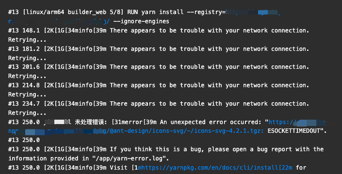
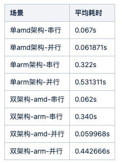
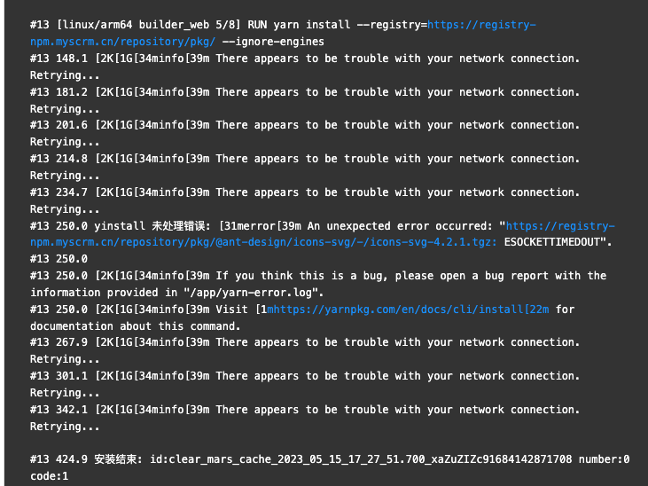

背景
--

最近公司有镜像支持双架构(amd64与arm64)的场景，记录一下怎么使用buildx构建双架构镜像与怎么解决一些碰到的问题

结论
--

在我们的CI场景(构建机器是amd64架构)

*   构建arm64架构磁盘IO速度比构建amd架构磁盘IO速递慢7倍
*   构建arm64架构网络IO速度比构建amd架构网络IO速递慢5-8倍

虽然buildx解决了多架构镜像构建，但是通过QEMU策略来模拟构建的时候，会存在网络IO与磁盘IO的问题，所以为了避免这个问题，应当尽可能的使用buildkit缓存，另外就是合理利用阶段构建与交叉编译，通过buildx注入的环境变量，完成一些有差异的功能

感兴趣的可以继续往下看

什么是docker buildx
----------------

Docker Buildx 是 Docker 的一个插件，它提供了一种简单、高效的方式来构建和打包 Docker 镜像。它能够在多个平台上构建和输出 Docker 镜像，包括 Linux、Windows、macOS 等，支持 CPU 架构和操作系统等多种参数的设置。

Docker Buildx 在构建镜像时使用了 BuildKit ，这是 Docker 官方推出的一个基于 Go 语言实现的高性能构建引擎。BuildKit 提供了更快的构建速度、更小的镜像体积、更好的缓存管理等优势，也可以在 Docker Buildx 之外使用。

使用 Docker Buildx，可以将不同平台上的 Docker 镜像构建合并到一个 manifest 中，使得用户只需要下载一个 manifest，就可以获取多个平台的镜像。这为跨平台开发和分发应用程序提供了很大的便利。

buildx构建多平台镜像
-------------

### 安装

buildx 是一个管理 Docker 构建的 CLI 插件，底层使用 [BuildKit](https://xie.infoq.cn/link?target=https%3A%2F%2Fdocs.docker.com%2Fbuild%2Fbuildkit%2F) 扩展了 Docker 构建功能。

要安装并使用 buildx，需要 Docker Engine 版本号大于等于 19.03。

如果使用的是 Docker Desktop，则默认安装了 buildx。可以使用 docker buildx version 命令查看安装版本。

```text
github.com/docker/buildx v0.10.4 c513d34049e499c53468deac6c4267ee72948f02
```

如果是手动安装，可以根据[文档](https://github.com/docker/buildx#manual-download)进行安装

### 构建多平台镜像

#### builx的三种构建策略

buildx提供了三种策略来构建多平台镜像

1.  在内核中使用 [QEMU](https://xie.infoq.cn/link?target=https%3A%2F%2Fzh.wikipedia.org%2Fwiki%2FQEMU) 仿真支持。
2.  使用相同的构建器实例在多个本机节点上构建。
3.  此方法直接在对应平台的硬件上构建镜像，所以需要准备各个平台的主机。因为此方法门槛比较高，所以并不常使用。
4.  使用 Dockerfile 中的多阶段构建，交叉编译到不同的平台架构中。
5.  即在第一个阶段构建某一平台的产物，然后在第二个阶段用环境变量做判断，比如`$BUILDPLATFORM`, `$TARGETPLATFORM`，针对不同的平台进行二次构建，这样就可以构建出支持不同平台的产物

重点讲下QEMU，因为一般都会选择这种方式，来构建多平台镜像  
直接使用 Docker Desktop，则已经支持了 QEMU，QEMU 是最简单的构建跨平台镜像策略。它不需要对原有的 Dockerfile 进行任何更改，BuildKit 会通过 [binfmt\_misc](https://xie.infoq.cn/link?target=https%3A%2F%2Fzh.wikipedia.org%2Fwiki%2FBinfmt_misc) 这一 Linux 内核功能实现跨平台程序的执行。

工作原理：  
QEMU 是一个处理器模拟器，可以模拟不同的 CPU 架构，我们可以把它理解为是另一种形式的虚拟机。在 buildx 中，QEMU 用于在构建过程中执行非本地架构的二进制文件。例如，在 amd64 主机上构建一个 ARM 镜像时，QEMU 可以模拟 ARM 环境并运行 ARM 二进制文件。

binfmt\_misc 是 Linux 内核的一个模块，它允许用户注册可执行文件格式和相应的解释器。当内核遇到未知格式的可执行文件时，会使用 binfmt\_misc 查找与该文件格式关联的解释器（在这种情况下是 QEMU）并运行文件。

QEMU 和 binfmt\_misc 的结合使得通过 buildx 跨平台构建成为可能。这样我们就可以在一个架构的主机上构建针对其他架构的 Docker 镜像，而无需拥有实际的目标硬件。

虽然 Docker Desktop 预配置了 binfmt\_misc 对其他平台的支持，但对于其他版本 Docker，你可能需要使用 tonistiigi/binfmt 镜像启动一个特权容器来进行支持：

```sh
docker run --privileged --rm tonistiigi/binfmt --install all
```

#### 构建多平台镜像

第一步：执行`docker buildx ls`查看已存在的builders

```sh
NAME/NODE       DRIVER/ENDPOINT             STATUS  BUILDKIT PLATFORMS
default         docker
    default       default                     running 23.0.5   linux/arm64, linux/amd64, linux/amd64/v2, linux/riscv64, linux/ppc64le, linux/s390x, linux/386, linux/mips64le, linux/mips64, linux/arm/v7, linux/arm/v6
desktop-linux   docker
    desktop-linux desktop-linux               running 23.0.5   linux/arm64, linux/amd64, linux/amd64/v2, linux/riscv64, linux/ppc64le, linux/s390x, linux/386, linux/mips64le, linux/mips64, linux/arm/v7, linux/arm/v6
```

第二步：创建新的builder

```sh
docker buildx create --name mybuilder --driver docker-container --bootstrap
```

第三步：启用新的builder

```sh
docker buildx use mybuilder
```

第四步：查看新的builder是否被启动

```sh
docker buildx inspect
 
Name:          mybuilder
Driver:        docker-container
Last Activity: 2023-05-15 06:56:40 +0000 UTC
 
Nodes:
Name:      mybuilder0
Endpoint:  unix:///var/run/docker.sock
Status:    running
Buildkit:  v0.11.6
Platforms: linux/arm64, linux/amd64, linux/amd64/v2, linux/riscv64, linux/ppc64le, linux/s390x, linux/386, linux/mips64le, linux/mips64, linux/arm/v7, linux/arm/v6
```

第五步：对项目镜像多平台镜像构建

```sh
// --platform指定构建的平台镜像
docker buildx build --platform linux/amd64,linux/arm64 -t mytest:latest --push=false .
```

第六步：查看镜像元数据

```sh
docker buildx imagetools inspect mytest:latest
```

多阶段构建，交叉编译
----------

通过多阶段构建与交叉编译可以更方便的帮助我们完成一些任务，比如前端or nodejs项目有一些依赖包，会依赖一些二进制文件，比如grpc、node-sass等

这些二进制依赖都是与nodejs版本、当前系统架构强绑定的，所以在一个dockerfile中，构建出支持多架构的镜像，又不想多次install就可以，借助多阶段构建与交叉编译来达成我们一次install的目的

### 环境变量

要使用交叉编译依赖一些环境变量，常用的两个环境变量如下所示

*   `$BUILDPLATFORM` 构建镜像主机平台
*   `$TARGETPLATFORM` 构建镜像的目标平台，例如 `linux/amd64, linux/arm/v7, windows/amd64`

在dockerfile中除了第一行From的时候可以直接使用`$BUILDPLATFORM`，后面的命令中需要使用都需要通过ARG先声明变量，在使用

```dockerfile
ARG TARGETPLATFORM
ARG BUILDPLATFORM
RUN echo "I am running on $BUILDPLATFORM, building for $TARGETPLATFORM"
```

```text

#14 [linux/arm64->amd64 builder_web  4/10] RUN echo "I am running on linux/arm64, building for linux/amd64"
#0 0.043 I am running on linux/arm64, building for linux/amd64
#14 DONE 0.1s
 
#15 [linux/arm64 builder_web  4/10] RUN echo "I am running on linux/arm64, building for linux/arm64"
#0 0.043 I am running on linux/arm64, building for linux/arm64
#15 DONE 0.1s
```

从日志可以看到`$BUILDPLATFORM`表示当前构建机器的架构，`$TARGETPLATFORM`表示要编译成的架构镜像

### 处理二进制文件

```dockerfile
# 构建阶段基础镜像
FROM --platform=$BUILDPLATFORM yunke-registry.cn-hangzhou.cr.aliyuncs.com/yued/alinode:v2-14.18.1-1.24.6 as bff_build
  
# 工作目录
WORKDIR /workspace/app
  
# 拷贝依赖文件
COPY ./package.json /workspace/app/package.json
COPY ./yarn.lock /workspace/app/yarn.lock
  
# 安装依赖
RUN yarn install --frozen-lockfile --check-files --registry=https://registry-npm.myscrm.cn/repository/pkg/
  
# 拷贝源码
COPY . /workspace/app
  
# 当前构建分支
ARG BRANCH
 
ARG TARGETPLATFORM
  
# 构建 & 移动 node_modules（之所以要移动 node_modules，是为了后续层的复用）
RUN branch=$BRANCH yarn build && cp -R /workspace/app/node_modules /workspace/deps
  
# 部署阶段基础镜像
FROM yunke-registry.cn-hangzhou.cr.aliyuncs.com/yued/alinode:v2-14.18.1-1.24.6
  
# 工作目录
WORKDIR /workspace/app
  
# 拷贝依赖
COPY --from=bff_build /workspace/app/package.json /workspace/app/package.json
COPY --from=bff_build /workspace/app/yarn.lock /workspace/app/yarn.lock
COPY --from=bff_build /workspace/deps /workspace/app/node_modules
# COPY --from=bff_build /workspace/.npmrc /workspace/app/.npmrc
  
# 处理 arm 架构
RUN if [ $TARGETPLATFORM != "linux/amd64" ]; then \
      wget "https://yued.myscrm.cn/x86-to-arm/x86-to-arm.sh" -P /workspace/app \
      && sh -x "/workspace/app/x86-to-arm.sh"; \
  fi
  
# 拷贝内容
COPY --from=bff_build /workspace/app /workspace/app
  
# 启动
CMD yarn run run
```

而`x86-to-arm.sh`内的功能主要就是

*   处理grpc这样的依赖平台的二进制包

验证网络IO与读写IO
-----------

以我们的CI构建机器为例，构架机器架构是linux/amd64，在构建amd与arm双平台且没有使用buildkit缓存的场景下，arm任务中yarn install很容易出现npm包拉不下来，导致构建阻塞，如下图所示 

那么yarn install触发超时的原因是什么？怎么避免触发超时及怎么解决这个超时问题

首先我们验证了不同环境下，pnpm与yarn install的多组数据，主要目的有以下几个

*   验证QEMU策略下构建单架构是否有问题
*   验证QEMU策略下构建双架构是否有问题
*   验证网络IO速度
*   验证文件读写IO速度

### 验证QEMU策略下构建单架构

线上数据都来源于架构微linux/amd64的构建机器

#### 获取pnpm install 耗时

构建amd64架构镜像-测试环境-无全局缓存 pnpm install

```sh
#11 [builder_web 4/6] RUN --mount=type=cache,target=/app/node_modules,id=clear-mars-cache:yk-basis-fe:test,sharing=locked  --mount=type=cache,target=/root/.pnpm-store/v3  --mount=type=cache,target=/root/.local/share/pnpm  pnpm install --registry=https://registry-npm.myscrm.cn/repository/pkg/ --reporter ndjson
#11 0.766 {"time":1683875679070,"hostname":"buildkitsandbox","pid":1,"level":"debug","name":"pnpm:scope","selected":1}
...
#11 17.61 {"time":1683875695913,"hostname":"buildkitsandbox","pid":1,"level":"debug","name":"pnpm:summary","prefix":"/app"}
#11 17.61 {"time":1683875695914,"hostname":"buildkitsandbox","pid":1,"level":"debug","name":"pnpm:peer-dependency-issues","issuesByProjects":{".":{"bad":{"react":[{"foundVersion":"17.0.2","resolvedFrom":[],"parents":[{"name":"@yunke/yunked","version":"2.7.4"},{"name":"@ant-design/compatible","version":"1.1.2"},{"name":"rc-editor-mention","version":"1.1.13"},{"name":"draft-js","version":"0.10.5"}],"optional":false,"wantedRange":"^0.14.0 || ^15.0.0-rc || ^16.0.0-rc || ^16.0.0"}],"react-dom":[{"foundVersion":"17.0.2","resolvedFrom":[],"parents":[{"name":"@yunke/yunked","version":"2.7.4"},{"name":"@ant-design/compatible","version":"1.1.2"},{"name":"rc-editor-mention","version":"1.1.13"},{"name":"draft-js","version":"0.10.5"}],"optional":false,"wantedRange":"^0.14.0 || ^15.0.0-rc || ^16.0.0-rc || ^16.0.0"}],"antd":[{"foundVersion":"4.21.5","resolvedFrom":[],"parents":[{"name":"@yunke/yunked","version":"2.7.4"},{"name":"@ant-design/compatible","version":"1.1.2"}],"optional":false,"wantedRange":"3.x"}]},"missing":{"prop-types":[{"parents":[{"name":"@yunke/yunked","version":"2.7.4"},{"name":"@ant-design/compatible","version":"1.1.2"},{"name":"rc-form","version":"2.4.12"}],"optional":false,"wantedRange":"^15.0"}],"supports-color":[{"parents":[{"name":"@yunke/yunked","version":"2.7.4"},{"name":"ali-oss","version":"6.17.1"},{"name":"urllib","version":"2.40.0"},{"name":"proxy-agent","version":"5.0.0"},{"name":"agent-base","version":"6.0.2"},{"name":"debug","version":"4.3.4"}],"optional":true,"wantedRange":"*"}],"rollup":[{"parents":[{"name":"@yunke/yunked","version":"2.7.4"},{"name":"react-countup","version":"6.4.2"},{"name":"@rollup/plugin-babel","version":"6.0.3"},{"name":"@rollup/pluginutils","version":"5.0.2"}],"optional":true,"wantedRange":"^1.20.0||^2.0.0||^3.0.0"},{"parents":[{"name":"@yunke/yunked","version":"2.7.4"},{"name":"react-countup","version":"6.4.2"},{"name":"@rollup/plugin-babel","version":"6.0.3"}],"optional":true,"wantedRange":"^1.20.0||^2.0.0||^3.0.0"}],"@babel/core":[{"parents":[{"name":"@yunke/yunked","version":"2.7.4"},{"name":"react-countup","version":"6.4.2"},{"name":"@rollup/plugin-babel","version":"6.0.3"}],"optional":false,"wantedRange":"^7.0.0"}],"@types/babel__core":[{"parents":[{"name":"@yunke/yunked","version":"2.7.4"},{"name":"react-countup","version":"6.4.2"},{"name":"@rollup/plugin-babel","version":"6.0.3"}],"optional":true,"wantedRange":"^7.1.9"}]},"conflicts":[],"intersections":{"prop-types":"^15.0","@babel/core":"^7.0.0"}}}}
#11 DONE 17.9s
```

耗时 17.9s  


构建arm64架构-测试环境-无全局缓存 pnpm install

```sh
#16 [builder_web 4/6] RUN --mount=type=cache,target=/app/node_modules,id=clear-mars-cache:yk-basis-fe:test,sharing=locked  --mount=type=cache,target=/root/.pnpm-store/v3  --mount=type=cache,target=/root/.local/share/pnpm  pnpm install --registry=https://registry-npm.myscrm.cn/repository/pkg/ --reporter ndjson
#16 0.921 {"time":1683876879391,"hostname":"buildkitsandbox","pid":1,"level":"debug","name":"pnpm:scope","selected":1}
...
#16 21.48 {"time":1683876899951,"hostname":"buildkitsandbox","pid":1,"level":"debug","name":"pnpm:summary","prefix":"/app"}
#16 21.48 {"time":1683876899951,"hostname":"buildkitsandbox","pid":1,"level":"debug","name":"pnpm:peer-dependency-issues","issuesByProjects":{".":{"bad":{"react":[{"foundVersion":"17.0.2","resolvedFrom":[],"parents":[{"name":"@yunke/yunked","version":"2.7.4"},{"name":"@ant-design/compatible","version":"1.1.2"},{"name":"rc-editor-mention","version":"1.1.13"},{"name":"draft-js","version":"0.10.5"}],"optional":false,"wantedRange":"^0.14.0 || ^15.0.0-rc || ^16.0.0-rc || ^16.0.0"}],"react-dom":[{"foundVersion":"17.0.2","resolvedFrom":[],"parents":[{"name":"@yunke/yunked","version":"2.7.4"},{"name":"@ant-design/compatible","version":"1.1.2"},{"name":"rc-editor-mention","version":"1.1.13"},{"name":"draft-js","version":"0.10.5"}],"optional":false,"wantedRange":"^0.14.0 || ^15.0.0-rc || ^16.0.0-rc || ^16.0.0"}],"antd":[{"foundVersion":"4.21.5","resolvedFrom":[],"parents":[{"name":"@yunke/yunked","version":"2.7.4"},{"name":"@ant-design/compatible","version":"1.1.2"}],"optional":false,"wantedRange":"3.x"}]},"missing":{"prop-types":[{"parents":[{"name":"@yunke/yunked","version":"2.7.4"},{"name":"@ant-design/compatible","version":"1.1.2"},{"name":"rc-form","version":"2.4.12"}],"optional":false,"wantedRange":"^15.0"}],"supports-color":[{"parents":[{"name":"@yunke/yunked","version":"2.7.4"},{"name":"ali-oss","version":"6.17.1"},{"name":"urllib","version":"2.40.0"},{"name":"proxy-agent","version":"5.0.0"},{"name":"agent-base","version":"6.0.2"},{"name":"debug","version":"4.3.4"}],"optional":true,"wantedRange":"*"}],"rollup":[{"parents":[{"name":"@yunke/yunked","version":"2.7.4"},{"name":"react-countup","version":"6.4.2"},{"name":"@rollup/plugin-babel","version":"6.0.3"},{"name":"@rollup/pluginutils","version":"5.0.2"}],"optional":true,"wantedRange":"^1.20.0||^2.0.0||^3.0.0"},{"parents":[{"name":"@yunke/yunked","version":"2.7.4"},{"name":"react-countup","version":"6.4.2"},{"name":"@rollup/plugin-babel","version":"6.0.3"}],"optional":true,"wantedRange":"^1.20.0||^2.0.0||^3.0.0"}],"@babel/core":[{"parents":[{"name":"@yunke/yunked","version":"2.7.4"},{"name":"react-countup","version":"6.4.2"},{"name":"@rollup/plugin-babel","version":"6.0.3"}],"optional":false,"wantedRange":"^7.0.0"}],"@types/babel__core":[{"parents":[{"name":"@yunke/yunked","version":"2.7.4"},{"name":"react-countup","version":"6.4.2"},{"name":"@rollup/plugin-babel","version":"6.0.3"}],"optional":true,"wantedRange":"^7.1.9"}]},"conflicts":[],"intersections":{"prop-types":"^15.0","@babel/core":"^7.0.0"}}}}
#16 DONE 21.9s
```

耗时21.9s  

**看的出来在构建单架构场景下，使用pnpm install，arm64速度要比amd64速度慢18%**

#### 获取yarn install 耗时

amd64架构-测试环境-无全局缓存 yarn install

```sh
#10 [builder_web 4/6] RUN --mount=type=cache,target=/app/node_modules,id=clear-mars-cache:yk-basis-fe:test,sharing=locked  --mount=type=cache,target=/usr/local/share/.cache/yarn/v6  --mount=type=cache,target=/usr/local/share/.cache/yarn/v4  yarn install --registry=https://registry-npm.myscrm.cn/repository/pkg/ --verbose
#10 0.230 userHome:  /usr/local/share
#10 0.245 当前yinstall version: 0.0.1-beta.9
#10 0.246 实际执行命令(yinstall): yarnpkg install --registry=https://registry-npm.myscrm.cn/repository/pkg/ --verbose
#10 0.476 yarn install v1.22.15
#10 0.502 verbose 0.245323426 Checking for configuration file "/app/.npmrc"
...
#10 19.83 verbose 19.576662853 Copying "/usr/local/share/.cache/yarn/v6/npm-esprima-4.0.1-13b04cdb3e6c5d19df91ab6987a8695619b0aa71-integrity/node_modules/esprima/bin/esvalidate.js" to "/app/node_modules/esprima/bin/esvalidate.js".
#10 19.83 verbose 19.576878245 Copying "/usr/local/share/.cache/yarn/v6/npm-esprima-4.0.1-13b04cdb3e6c5d19df91ab6987a8695619b0aa71-integrity/node_modules/esprima/dist/espr
#10 19.83 [output clipped, log limit 2MiB reached]
 
#10 DONE 25.4s
```

耗时25s  


arm架构-测试环境-无全局缓存 yarn install

```sh
#12 [builder_web 4/6] RUN --mount=type=cache,target=/app/node_modules,id=clear-mars-cache:yk-basis-fe:test,sharing=locked  --mount=type=cache,target=/usr/local/share/.cache/yarn/v6  --mount=type=cache,target=/usr/local/share/.cache/yarn/v4  yarn install --registry=https://registry-npm.myscrm.cn/repository/pkg/ --verbose
#12 0.237 userHome:  /usr/local/share
#12 0.252 当前yinstall version: 0.0.1-beta.9
#12 0.254 实际执行命令(yinstall): yarnpkg install --registry=https://registry-npm.myscrm.cn/repository/pkg/ --verbose
#12 0.488 yarn install v1.22.15
#12 0.518 verbose 0.255479419 Checking for configuration file "/app/.npmrc".
#12 0.519 verbose 0.25614191 Checking for configuration file "/usr/local/share/.npmrc".
...
#12 26.70 verbose 26.436327155 Copying "/usr/local/share/.cache/yarn/v6/npm-draft-js-0.10.5-bfa9beb018fe0533dbb08d6675c371a6b08fa742-integrity/node_modules/draft-js/lib/AtomicBlockUtils.js.flow" to "/app/node_modules/draft-js/lib/AtomicBlockUtils.js.flow".
#12 26.70 verbose 26.436478399 Copying "/usr/local/share/.cache/yarn/v6/npm-draft-js-0.10.5-bfa9beb018fe0533dbb08d6675c371a6b08fa742-integrity/node_modules/draft-js/lib/BlockMap.js" to "/app/node_modules/draft-js/lib/BlockMap.js".
#12 26.70 verbose 26.436607888 Copying "/usr/local/share/.cache/yarn/v6/npm-draft-js-0.10.5-bfa9beb018fe0533dbb08d6675c371a6b08fa74
#12 26.70 [output clipped, log limit 2MiB reached]
 
#12 DONE 32.4s
```

耗时32s  

**看的出来在构建单架构场景下，使用yarn install，arm64速度要比amd64速度慢22%**

#### 小结

从上面两组数据看，剔除yarn与pnpm本身的问题，构建arm64镜像，在没有缓存的场景下要慢于构建amd64镜像的场景

### 验证不同架构构建机器构建双架构速度

#### 预发布构建双架构

构建机器linux/amd64  
构建双架构(arm66、amd64)-预发布-无全局缓存 yarn install

```sh
[linux/arm64 builder_web 5/7] RUN yarn install --registry=https://registry-npm.myscrm.cn/repository/pkg/ --ignore-engines
#9 1.620 userHome:  /usr/local/share
#9 1.841 当前yinstall version: 0.0.1-beta.9
#9 1.853 实际执行命令(yinstall): yarnpkg install --registry=https://registry-npm.myscrm.cn/repository/pkg/ --ignore-engines
#9 4.006 [2K[1G[1myarn install v1.22.17[22m
#9 4.393 [2K[1G[34minfo[39m No lockfile found.
#9 4.468 [2K[1G[2m[1/4][22m Resolving packages...
 
 
 
#24 [linux/amd64 builder_web 5/7] RUN yarn install --registry=https://registry-npm.myscrm.cn/repository/pkg/ --ignore-engines
#24 0.184 userHome:  /usr/local/share
#24 0.198 当前yinstall version: 0.0.1-beta.9
#24 0.199 实际执行命令(yinstall): yarnpkg install --registry=https://registry-npm.myscrm.cn/repository/pkg/ --ignore-engines
#24 0.407 yarn install v1.22.17
#24 0.457 info No lockfile found.
#24 0.469 [1/4] Resolving packages...
 
 
...
#24 [linux/amd64 builder_web 5/7] RUN yarn install --registry=https://registry-npm.myscrm.cn/repository/pkg/ --ignore-engines
#24 73.11 [2K[1G[2m[4/4][22m Building fresh packages...
#24 75.84 [2K[1G[32msuccess[39m Saved lockfile.
#24 75.85 [2K[1GDone in 75.45s.
#24 76.05 安装结束: id:clear_mars_cache_2023_05_12_16_28_49.606_J7yeIDhse1683880129607 number:0 code:0
 
 
#9 [linux/arm64 builder_web 5/7] RUN yarn install --registry=https://registry-npm.myscrm.cn/repository/pkg/ --ignore-engines
#9 103.4 [2K[1G[34minfo[39m There appears to be trouble with your network connection. Retrying...
#9 136.6 [2K[1G[34minfo[39m There appears to be trouble with your network connection. Retrying...
#9 169.7 [2K[1G[34minfo[39m There appears to be trouble with your network connection. Retrying...
#9 173.4 [2K[1G[34minfo[39m There appears to be trouble with your network connection. Retrying...
#9 202.8 [2K[1G[34minfo[39m There appears to be trouble with your network connection. Retrying...
#9 206.5 [2K[1G[34minfo[39m There appears to be trouble with your network connection. Retrying...
#9 238.7 yinstall 未处理错误: [1G[31merror[39m An unexpected error occurred: "https://registry-npm.myscrm.cn/repository/pkg/@ant-design/icons-svg/-/icons-svg-4.2.1.tgz: ESOCKETTIMEDOUT".
#9 238.7
#9 238.7 [2K[1G[34minfo[39m If you think this is a bug, please open a bug report with the information provided in "/app/yarn-error.log".
#9 238.7 [2K[1G[34minfo[39m Visit [1mhttps://yarnpkg.com/en/docs/cli/install[22m for documentation about this command.
#9 239.6 [2K[1G[34minfo[39m There appears to be trouble with your network connection. Retrying...
#9 272.6 [2K[1G[34minfo[39m There appears to be trouble with your network connection. Retrying...
 
#9 318.0 安装结束: id:clear_mars_cache_2023_05_12_16_28_51.021_V6uSGD1hL1683880131029 number:0 code:1
```

从日志可以看出来，arm64架构下yarn install失败，而amd64架构下yarn install成功  

#### 本地构建双架构

构建机器linux/arm64  
构建双架构(arm66、amd64)-本地(mac arm架构)-无全局缓存 yarn install  
构建命令如下`docker buildx build --progress=plain --platform=linux/amd64,linux/arm64 --output type=image,name=myimage:latest,push=false .`

```sh

#16 [linux/arm64 builder_web 4/6] RUN yarn install --registry=https://registry-npm.myscrm.cn/repository/pkg/ --ignore-engines --verbose |grep -v 'Copying' |grep -v 'Creating'
#16 54.75 安装结束: id:clear_mars_cache_2023_05_12_18_28_56.063_4SoDdU9831683887336063 number:0 code:0
#16 DONE 54.9s
 
 
#19 [linux/amd64 builder_web 4/6] RUN yarn install --registry=https://registry-npm.myscrm.cn/repository/pkg/ --ignore-engines --verbose |grep -v 'Copying' |grep -v 'Creating'
#19 46.49 安装结束: id:clear_mars_cache_2023_05_12_18_29_09.477_y37acNwZI1683887349480 number:0 code:0
#19 DONE 46.6s
```

二者都安装成功，且时间相差无几  

#### 小结

预发布与本地最大的差别就是，预发布是linux/amd64架构，而本地是linux/arm64架构，所以本地构建arm64没任何问题，模拟构建amd64也没什么问题

构建机器是amd64场景模拟构建arm64架构镜像存在网络IO问题，相关的issues[\[buildx/arm64\] yarn and npm not able to download packages from internet](https://github.com/nodejs/docker-node/issues/1335)

### 验证amd64架构下模拟构建arm64网络IO慢多少

#### 获取构建amd64镜像中curl时间

串行

```sh

#8 0.134 TARGETPLATFORM, linux/amd64!
#8 0.134 Testing https://registry-npm.myscrm.cn/repository/pkg/@ant-design/icons-svg/-/icons-svg-4.2.1.tgz 10 times...
#8 0.219 Time for request 1: 0.071765 seconds
#8 0.295 Time for request 2: 0.066437 seconds
#8 0.372 Time for request 3: 0.068291 seconds
#8 0.449 Time for request 4: 0.067475 seconds
#8 0.526 Time for request 5: 0.066825 seconds
#8 0.601 Time for request 6: 0.064963 seconds
#8 0.677 Time for request 7: 0.065933 seconds
 
#8 0.754 Time for request 8: 0.066081 seconds
#8 0.832 Time for request 9: 0.068788 seconds
#8 0.911 Time for request 10: 0.068151 seconds
#8 0.913 Average response time: .067 seconds
#8 DONE 1.0s
```

并发10

```sh
#9 0.146 parallel TARGETPLATFORM, linux/amd64!
#9 0.146 Testing https://registry-npm.myscrm.cn/repository/pkg/@ant-design/icons-svg/-/icons-svg-4.2.1.tgz with 10 concurrent requests...
#9 0.211 Response time for request 10
#9 0.212 Response time for request 2
#9 0.212 Response time for request 9
#9 0.214 Response time for request 8
#9 0.220 Response time for request 3
#9 0.220 Response time for request 7
#9 0.220 Response time for request 1
#9 0.221 Response time for request 5
#9 0.221 Response time for request 4
#9 0.222 Response time for request 6
#9 0.222 request10,0.056216
#9 0.222 request2,0.056983
#9 0.222 request9,0.056698
#9 0.222 request8,0.057722
#9 0.222 request7,0.064321
#9 0.222 request3,0.064468
#9 0.222 request4,0.065188
#9 0.222 request1,0.065976
#9 0.222 request5,0.065381
#9 0.222 request6,0.065756
#9 0.226 totle: 0.618709
#9 0.226 myCount: 10.000000
#9 0.226 avg: 0.061871
#9 DONE 0.3s
```

#### 获取构建arm64镜像中curl时间

串行

```sh

#7 0.151 TARGETPLATFORM, linux/arm64!
#7 0.153 Testing https://registry-npm.myscrm.cn/repository/pkg/@ant-design/icons-svg/-/icons-svg-4.2.1.tgz 10 times...
#7 0.632 Time for request 1: 0.327555 seconds
#7 1.078 Time for request 2: 0.322874 seconds
#7 1.524 Time for request 3: 0.323411 seconds
#7 1.962 Time for request 4: 0.315317 seconds
#7 2.404 Time for request 5: 0.320621 seconds
#7 2.844 Time for request 6: 0.318043 seconds
#7 3.295 Time for request 7: 0.320653 seconds
#7 3.734 Time for request 8: 0.317438 seconds
 
#7 4.177 Time for request 9: 0.320958 seconds
#7 4.633 Time for request 10: 0.333655 seconds
#7 4.665 Average response time: .322 seconds
```

并发

```sh
#9 [builder_web 8/9] RUN sh /app/collect-time1.sh linux/arm64
#9 0.183 parallel TARGETPLATFORM, linux/arm64!
#9 0.185 Testing https://registry-npm.myscrm.cn/repository/pkg/@ant-design/icons-svg/-/icons-svg-4.2.1.tgz with 10 concurrent requests...
 
#9 0.929 Response time for request 1
#9 0.941 Response time for request 7
#9 1.007 Response time for request 4
#9 1.083 Response time for request 6
#9 1.099 Response time for request 10
#9 1.126 Response time for request 3
#9 1.127 Response time for request 9
#9 1.134 Response time for request 2
#9 1.148 Response time for request 5
#9 1.153 Response time for request 8
#9 1.175 request1,0.543722
#9 1.175 request7,0.562819
#9 1.175 request4,0.607979
#9 1.175 request6,0.450597
#9 1.175 request10,0.496050
#9 1.175 request3,0.539319
#9 1.175 request2,0.537783
#9 1.175 request9,0.544992
#9 1.175 request5,0.456853
#9 1.175 request8,0.572999
#9 1.219 totle: 5.313113
#9 1.219 myCount: 10.000000
#9 1.220 avg: 0.531311
#9 DONE 1.3s
```

#### 获取构建amd64与arm64镜像中curl时间

串行

```sh
#11 0.130 TARGETPLATFORM, linux/amd64!
#11 0.130 Testing https://registry-npm.myscrm.cn/repository/pkg/@ant-design/icons-svg/-/icons-svg-4.2.1.tgz 10 times...
#11 0.203 Time for request 1: 0.064090 seconds
#11 0.272 Time for request 2: 0.061100 seconds
#11 0.342 Time for request 3: 0.062174 seconds
#11 0.415 Time for request 4: 0.064364 seconds
#11 0.488 Time for request 5: 0.064550 seconds
#11 0.560 Time for request 6: 0.063473 seconds
#11 0.629 Time for request 7: 0.062006 seconds
 
#11 0.699 Time for request 8: 0.062100 seconds
#11 0.766 Time for request 9: 0.058811 seconds
#11 0.837 Time for request 10: 0.063600 seconds
#11 0.838 Average response time: .062 seconds
#11 DONE 0.9s
 
 
#35 0.195 TARGETPLATFORM, linux/arm64!
#35 0.197 Testing https://registry-npm.myscrm.cn/repository/pkg/@ant-design/icons-svg/-/icons-svg-4.2.1.tgz 10 times...
#35 0.733 Time for request 1: 0.381984 seconds
#35 1.249 Time for request 2: 0.347377 seconds
#35 1.714 Time for request 3: 0.334947 seconds
#35 2.198 Time for request 4: 0.355312 seconds
#35 2.665 Time for request 5: 0.338311 seconds
#35 3.132 Time for request 6: 0.340468 seconds
 
#35 3.580 Time for request 7: 0.322425 seconds
#35 4.041 Time for request 8: 0.324398 seconds
#35 4.492 Time for request 9: 0.326015 seconds
#35 4.962 Time for request 10: 0.336956 seconds
#35 4.994 Average response time: .340 seconds
#35 DONE 5.1s
```

并发10

[?](#)

```sh
#15 [linux/amd64 builder_web 8/9] RUN sh /app/collect-time1.sh linux/amd64
#15 0.130 parallel TARGETPLATFORM, linux/amd64!
#15 0.130 Testing https://registry-npm.myscrm.cn/repository/pkg/@ant-design/icons-svg/-/icons-svg-4.2.1.tgz with 10 concurrent requests...
#15 0.194 Response time for request 3
#15 0.198 Response time for request 8
#15 0.198 Response time for request 10
#15 0.199 Response time for request 5
#15 0.199 Response time for request 2
#15 0.201 Response time for request 7
#15 0.202 Response time for request 9
#15 0.202 Response time for request 6
#15 0.202 Response time for request 1
#15 0.205 Response time for request 4
#15 0.206 request3,0.055327
#15 0.206 request8,0.057457
#15 0.206 request10,0.056999
#15 0.206 request2,0.058651
#15 0.206 request5,0.059558
#15 0.206 request7,0.060014
#15 0.206 request9,0.059339
#15 0.206 request6,0.063946
#15 0.206 request1,0.064201
#15 0.206 request4,0.064186
#15 0.207 totle: 0.599678
#15 0.207 myCount: 10.000000
#15 0.207 avg: 0.059968
#15 DONE 0.3s
 
#29 [linux/arm64 builder_web 8/9] RUN sh /app/collect-time1.sh linux/arm64
#29 0.191 parallel TARGETPLATFORM, linux/arm64!
#29 0.192 Testing https://registry-npm.myscrm.cn/repository/pkg/@ant-design/icons-svg/-/icons-svg-4.2.1.tgz with 10 concurrent requests...
#29 0.724 Response time for request 2
#29 0.728 Response time for request 10
#29 0.743 Response time for request 9
#29 0.771 Response time for request 4
#29 0.774 Response time for request 6
#29 0.817 Response time for request 7
#29 0.818 Response time for request 5
#29 0.836 Response time for request 8
#29 0.839 Response time for request 3
#29 0.842 Response time for request 1
#29 0.858 request2,0.403913
#29 0.858 request10,0.393099
#29 0.858 request9,0.407073
#29 0.858 request4,0.443117
#29 0.858 request6,0.410003
#29 0.858 request7,0.454915
#29 0.858 request5,0.448907
#29 0.858 request8,0.482042
#29 0.858 request3,0.484758
#29 0.858 request1,0.498836
#29 0.891 totle: 4.426663
#29 0.892 myCount: 10.000000
#29 0.892 avg: 0.442666
#29 DONE 1.0s
```

#### 小结



在CI接测场景，arm架构网络IO速度比amd架构网络IO速递慢5-8倍

### 验证amd64架构下模拟构建arm64磁盘IO慢多少

#### 获取构建amd64与arm64镜像中文件读写时间

这里以yarn的Linking dependencies…这个阶段的耗时来作为对比，原因是Linking dependencies…这个阶段就是将全局缓存目录中的npm包拷贝到项目的node\_modules下，纯文件的读写，可以直接作为对比

```sh
#12 [linux/amd64 builder_web 5/8] RUN yarn install --registry=https://registry-npm.myscrm.cn/repository/pkg/ --ignore-engines --network-timeout=90000
#12 59.12 [3/4] Linking dependencies...
#12 59.12 warning "@yunke/yunked > @ant-design/compatible@1.1.2" has incorrect peer dependency "antd@3.x".
#12 59.12 warning "@yunke/yunked > @ant-design/compatible > rc-form@2.4.12" has unmet peer dependency "prop-types@^15.0".
#12 59.12 warning "braft-editor > draft-js@0.10.5" has incorrect peer dependency "react@^0.14.0 || ^15.0.0-rc || ^16.0.0-rc || ^16.0.0".
...
#12 [linux/amd64 builder_web 5/8] RUN yarn install --registry=https://registry-npm.myscrm.cn/repository/pkg/ --ignore-engines --network-timeout=90000
#12 80.86 [2K[1G[2m[4/4][22m Building fresh packages...
 
 
 
#24 [linux/arm64 builder_web 5/8] RUN yarn install --registry=https://registry-npm.myscrm.cn/repository/pkg/ --ignore-engines --network-timeout=90000
 
#24 340.5 [3/4] Linking dependencies...
#24 340.6 warning "@yunke/yunked > @ant-design/compatible@1.1.2" has incorrect peer dependency "antd@3.x".
#24 340.6 warning "@yunke/yunked > @ant-design/compatible > rc-form@2.4.12" has unmet peer dependency "prop-types@^15.0".
#24 340.6 warning "braft-editor > draft-js@0.10.5" has incorrect peer dependency "react@^0.14.0 || ^15.0.0-rc || ^16.0.0-rc || ^16.0.0".
#24 340.8 warning " > @testing-library/user-event@12.8.3" has unmet peer dependency "@testing-library/dom@>=7.21.4".
#24 501.1 [2K[1G[2m[4/4][22m Building fresh packages...
```

amd架构下copy文件耗时21.74s  
arm架构下copy文件耗时160.6s

#### 小结

在CI接测场景，arm架构磁盘IO速度比amd架构磁盘IO速递慢7倍

### 解决install超时

从上面的数据可以看到在不使用buildkit缓存的场景下，在amd64机器上构建arm64很容易出现yarn install超时，如下图所示



解决方法：

*   修改–network-timeout超时时间

```sh
// --network-timeout默认值是30 * 1000 ms
yarn install --network-timeout=90000
```

*   使用buildkit缓存

```sh
RUN --mount=type=cache,target=/app/node_modules,id=clear-mars-cache:yk-basis-fe:release,sharing=locked  --mount=type=cache,target=/usr/local/share/.cache/yarn/v6  --mount=type=cache,target=/usr/local/share/.cache/yarn/v4 yarn install
```