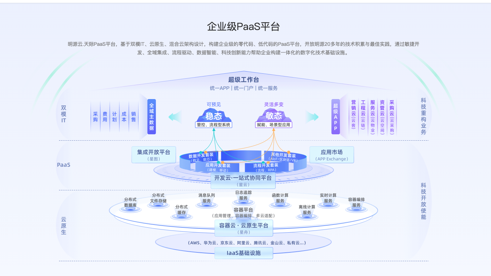
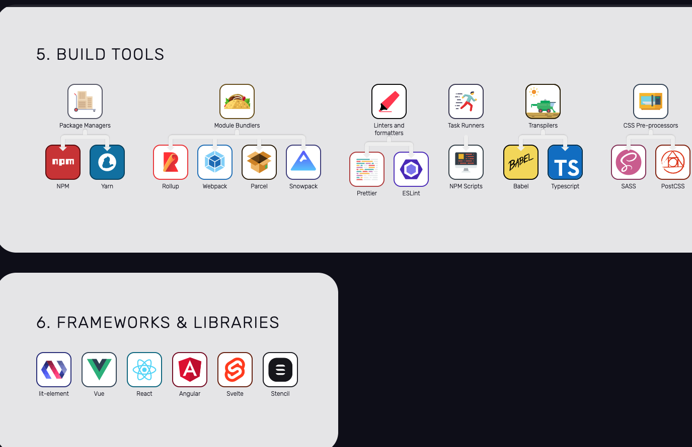
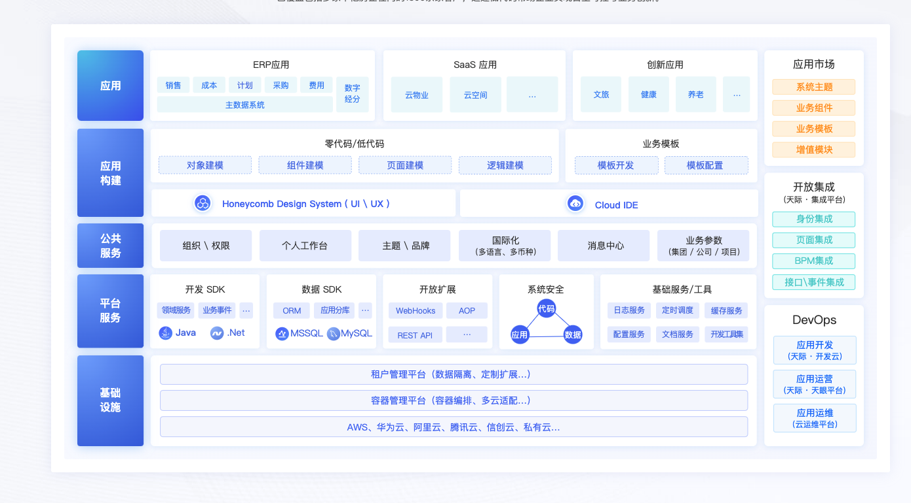
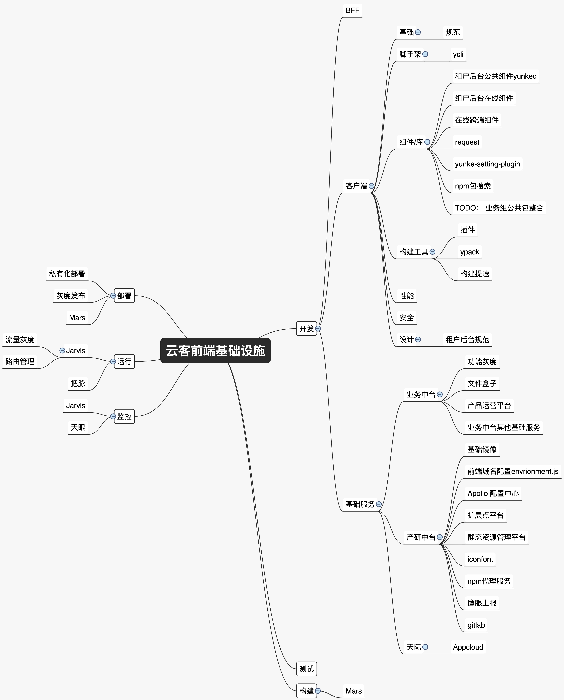
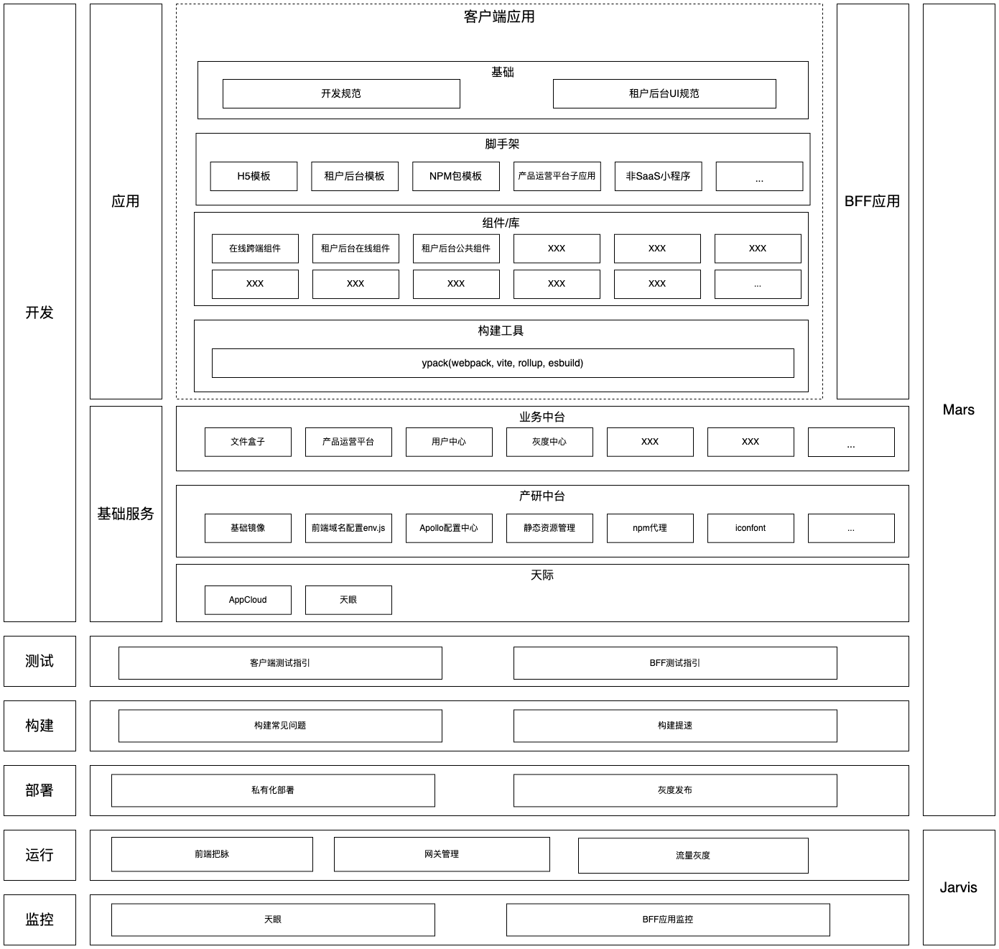
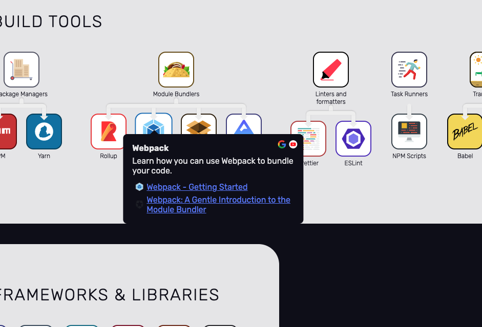

一、技术/业务预案
---------

技术预案要回答以下问题：

### 1、需求背景

云客前端对前端基础设施全貌信息了解不全。

### 2、痛点

a. 基础设施信息不集中；

*   文档链接过多，保存不方便

b.信息具有时效性；

*   如宣讲过私有化改造，在宣讲之后加入的同事并不知晓

### 3、期望达到的目标

信息集中且及时更新

### 4、目标用户群体

云客前端

### 5、实现思路讨论

天际

[https://open.mingyuanyun.com/](https://open.mingyuanyun.com/)

以服务视角展示

[https://andreasbm.github.io/web-skills/?compact](https://andreasbm.github.io/web-skills/?compact)

以能力视角展示

[https://open.mingyuanyun.com/product/platform](https://open.mingyuanyun.com/product/platform)

以架构图方式展示

### 6、实现难度

### 7、是否要做（结合投入和产出）

### 8、负责人

二、设计方案
------

在确定预案可行和投入产出比合适的情况下，由负责人继续实现细节，并组织会议讲演以下内容：

*   方案需求文档；
*   方案架构图；
*   方案实现的最小 DEMO；
*   新旧方案迁移方式；（可选）

如果方案涉及到业务组，如有必要需要与业务组相关人员共同商讨。

  

分层：以开发生命周期分为：开发，测试，构建，部署，运行，监控。

分区：功能职责分区

尝试以架构图展示

悬停展示

===============================================================================================================