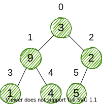

### 介绍

`堆`是是一个`完全二叉树`，并满足`堆属性`。

堆属性两种，对于给定完全二叉树中的`任意`节点：

1. 该节点的 key 总是 $>$ 它的子节点的 key，这种属性被叫做`最大堆` (max heap) 属性；
2. 该节点的 key 总是 $<$ 它的子节点的 key，这种属性被叫做`最小堆` (min heap) 属性。


### 操作

#### 堆化 (Heapify)

`堆化`是从一个二叉树中创建一个堆的过程,它被用于创建一个`最小堆`或`最大堆`。

1. 给定一个数组；


2. 从数组创建一个完全二叉树；



3. 找一个非叶子节点起始索引 (index) ，给定一个$n$ 长度的完全二叉树的数组，那么该 index 可以通过 $n/2 - 1$ 获取；


4. 设置当前元素索引 `i` 作为 `largest` ；
5. 当前元素`左孩子`的 index 则为：$2i + 1$，而`右孩子` index 则为：$2i + 2$；
   1. 若 `leftChild` $>$ `currentElement`，则设置 `leftChildIndex` 为 `largest` ；
   2. 若 `rightChild` $>$ `largest` 中元素，则设置 `rightChildIndex` 为 `largest` 。
6. 交换 `largest` 和 `currentElement` ；


7. 重复步骤`3-7`，直到子树都实现了堆化。

``` javascript
Heapify(array, size, i)
  set i as largest
  leftChild = 2i + 1
  rightChild = 2i + 2
  
  if leftChild > array[largest]
    set leftChildIndex as largest
  if rightChild > array[largest]
    set rightChildIndex as largest

  swap array[i] and array[largest]
```

创建最大堆：

``` javascript
MaxHeap(array, size)
  loop from the first index of non-leaf node down to zero
    call heapify
```

#### 插入元素

``` javascript
If there is no node, 
  create a newNode.
else (a node is already present)
  insert the newNode at the end (last node from left to right.)
  
heapify the array
```

#### 删除元素

``` javascript
If nodeToBeDeleted is the leafNode
  remove the node
Else swap nodeToBeDeleted with the lastLeafNode
  remove noteToBeDeleted
   
heapify the array
```

### 堆结构的应用

* 实现优先队列
* Dijkstra 算法
* 堆排序
