### 简介

树 (tree) 是一种广泛使用的抽象数据类型 (ADT) 。

一个简单的无序树如下图：

### 为何使用树结构？

像链表、栈、数组以及队列的`存储序列`都是线性数据结构。换句话说，对他们的任何操作的`时间复杂度`都会随着数据大小增长而增长，在现今的很多计算场景中，这种线性结构是不可接受的。

所以我们需要一种能够更快或更简单的访问数据的数据结构。

### 相关术语

* `节点 (Node)`: 一个包含键值对的实体并且指向他的子节点；
* `边 (Edge)`：连接两个节点的链接；
* `根节点 (root)`：一个树最顶层的节点；
* `叶子节点 (leaf nodes)`：也称为终端节点，没有子树的节点或者度为 0 的节点；
* `节点的高度 (Height of a Node)`：从当前节点到最深的叶子节点的边的个数；
* `节点的深度 (Depth of a Node)`：从 root 到当前节点的边的个数；
* `节点的度 (Degree of a Node)`：当前节点的分支总数；
* `分支节点`：也称为非终端节点，度不为零的节点称为非终端节点；
* `层 (level)`：从 root 开始，假设 root 为第 1 层，root 的子节点为第 2 层，依此类推，如果某一个节点位于第 L 层，则其子节点位于第 L+1 层。
* `树的深度 (depth)`：从 root 找到最大层 (level) 的值叫做`树深`，也可以叫`树高`。
* `森林 (Forest)`：不相交树的集合


### 二叉树

`二叉树 (binary trees)`是树的一种，它的每个节点`最多`有`2`个子节点。

#### 满二叉树

若树的每个节点只存在`2`个或`0`个子节点，这样的树叫做`满二叉树` (full binary tree) 。所以满二叉树的节点要么有 2 个子节点，要么就没有子节点。

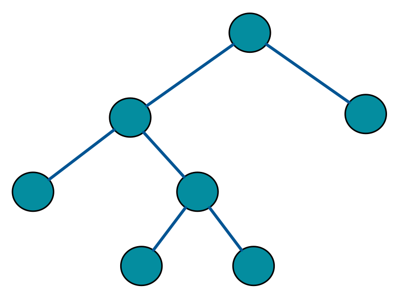

#### 完全二叉树

还有一种树被叫做`完全二叉树` (complete binary tree) ，它的特点：

1. 所有叶子节点`必须`靠左；
2. 叶子节点`允许`没有`右边`的兄弟节点，下面是一个完成二叉树:

#### 满二叉树 VS 完全二叉树

通过下面的图，明确他们之间的区别：


#### 全美二叉树

所有内部节点的度为`2`。

完美二叉树 (perfect binary tree) 的递归定义：

1. 若一个单节点无子节点，则它是一个高度 `h = 0` 的完美二叉树；
2. 若一个节点的高度 `h > 0`，则它是一个子树高度都为 `h - 1` 的完美二叉树。

下图为三个完美二叉树：


#### 病态或退化树

每个节点`只有`一个子节点，这样的树可以叫做`病态或退化树` (Degenerate or Pathological Tree) 。

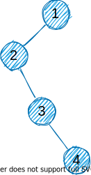

#### 平衡二叉树

若`任何`节点的子树中，`左边`子树和`右边`子树的`差异` (difference) 不超过 1。这里的`差异`值为：**difference = df = 左边子树的高度 - 右边子树的高度**。

下图分别表示了一个平衡二叉树和一个非平衡二叉树：


### 二叉搜索树

二叉搜索树 (binary search tree) ，简称 BST。也有叫做**二叉查找树**、**有序二叉树**或**排序二叉树**。之所以叫搜索树，因为二叉搜索树能够快速得执行`删除`、`插入`、`查找`等操作。

二叉搜索树的存储结构通常采用二叉链表，是`基础性`数据结构，用于构建更为抽象的数据结构。在构建时，是有固定排序规则，它是一个`有序树`。

二叉搜索树的性质：

1. 若任意`左子树` $\neq \varnothing$，则`左子树`所有节点值 $<$ root 的值；
2. 若任意`右子树` $\neq \varnothing$，则`右子树`所有节点值 $>$ root 的值；
3. 任意节点的左、右子树也分别为二叉查找树。

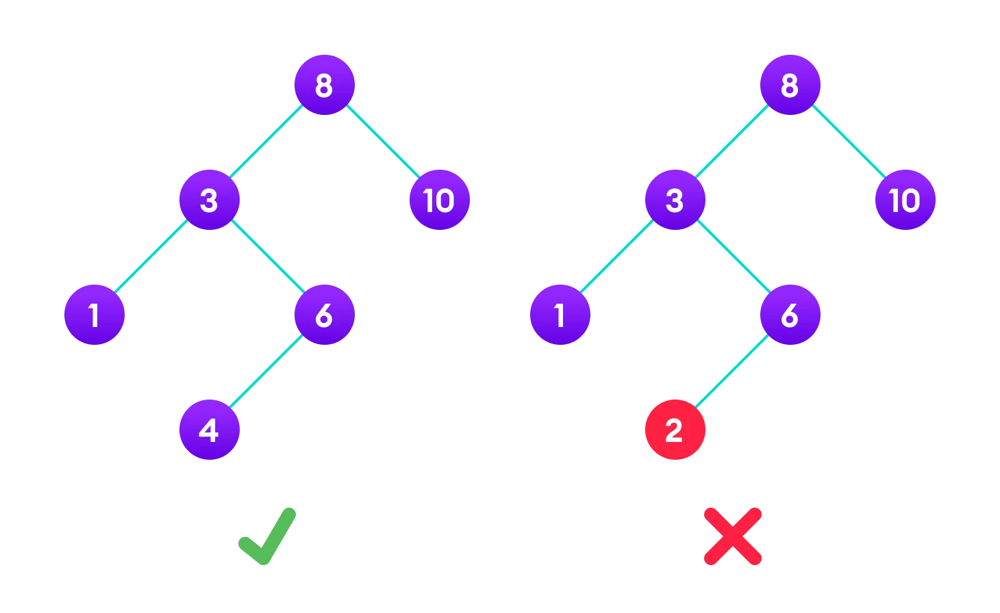

### AVL 树

AVL 树是一种`自平衡的二叉搜索树`，它的每个节点维护额外的信息，这种信息被叫做`平衡因子` (balance factor) 。

在 AVL 树中任何节点的两个子树的高度之差的绝对值最多为 `1`。

AVL 树得名于它的发明者 G. M. Adelson-Velsky 和 E. M. Landis，他们在1962年的论文《An algorithm for the organization of information》中发表了它。

#### 平衡因子

AVL 树中平衡因子是一个节点的左边子树高度和右边子树高度的差异值。

平衡因子 = (左子树的高度 $-$ 右子树的高度) 或 (右子树的高度 $-$ 左子树的高度)

平衡因子的值应该总是`-1`、`0`或`+1`三个值中的其中一个。

#### 旋转子树

在旋转操作中，子树节点位置发生交换，有两种旋转类型：

**1.左旋转 (left rotations)**


**2.右旋转 (right rotations)**


**3.左右旋转 (left-right and right-left rotations)**

1. 在左向右旋转中，优先左旋转，然后再右旋转。


2. 在左向右旋转中，优先右旋转，然后再左旋转。

