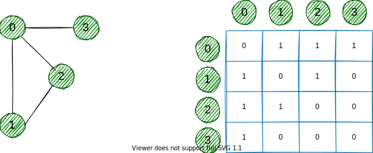

### 简介

图 (Graph) 是由顶点的`有穷非空集合`和顶点之间`边集合`组成，通常表示为：`G (V，E)` 。其中，G 表示一个图，V (vertex) 是顶点集合，E (edge) 是边集合。


对于上面的图可以这么去描述：

``` text
V = {0, 1, 2, 3}
E = {(0,1), (0,2), (0,3), (1,2)}
G = {V, E}
```

图可以分为`无向图` (undirected graph) 和`有向图` (directed graph) ：


### 术语

* `邻接 (Adjacency)`：一个顶点与另一个顶点直接相连，那么可以说这两个顶点相邻；
* `路径 (Path)`：表示一个顶点到另一个顶点所有的边序列；

### 图的表示

图的表示通常有`邻接矩阵` (Adjacency Matrix) 和`邻接表` (Adjacency List) 表示。

#### 邻接矩阵

一个相邻矩阵是一个 `VxV` 的二维数组，每一`行`和每一`列`表示顶点。

若任意一个矩阵元素 `a[i][j]` 的值为`1`，则表示一条边连接顶点 `i` 和顶点 `j` 。

下面是一个邻接矩阵的表示：



因为上面的图是一个无向图，对于边 (0,2) 的位置，我们同样能够用边 (2,0) 表示，所以可以看到一个无向图的矩阵是`对角线对称`的。

在一个邻接矩阵表示里，边的查找是极为快速的，但是需要对每个可能的相连顶点预留边的空间，所以这种表示方式要求更多的存储空间。

#### 邻接表

一个邻接表是由链表作为元素的一个数组。

数组的`索引`表示一个顶点，每个数组元素中`链表`表示其它顶点与当前索引顶点的构成的边集。


对于有限存储空间情况下，采用一个邻接表是非常有效的数据结构，因为我们只需要存储边界值。对于包含百万级顶点的图来说，它能节省更多空间。

### 图的操作

大部分通用的图包含以下几个操作：

* 检测其元素是否在图中；
* 图的遍历；
* 添加元素 (边和顶点) ；
* 找出一个顶点到另一个顶点的路径。

### 生成树

#### 无向图和连通图

在理解生成树 (Spanning tree) 之前，我们需要知道下面两种图：`无向图` (undirected graph) 和`连通图` (connected graph) ，上面的例子都是无向图。


* 一个无向图的边没有任何方向信息，换句话说它的边是双向的；
* 一个连通图任意一个顶点到另一个顶点的总能找到一条路径。

#### 生成树的例子

一个生成树是一个无向连通图的子图，该图的所有顶点都有最小化边的个数，若一个顶点消失，就不再是一个生成树。


#### 最小生成树

一个最小生成树是所有边的权重总和最小。

#### 生成树的应用

* 计算机网络路由协议；
* 集群分析；
* 民用电网规划。

#### 最小生成树的应用

* 地图上寻找最短路径；
* 设计网络 (例如：电话网络、水供给网络、电网等等) 。
