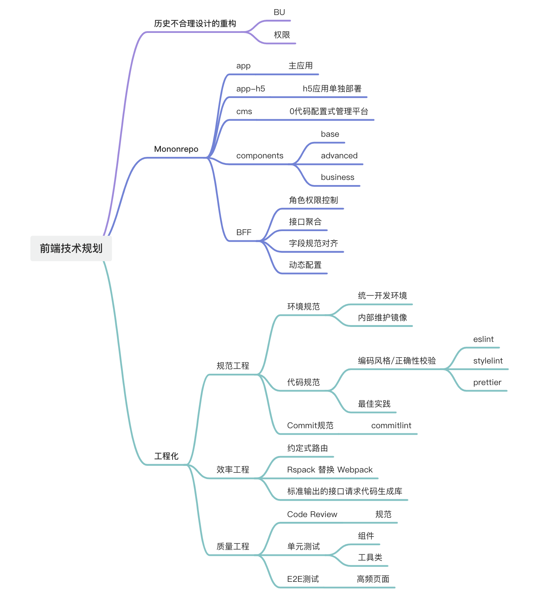
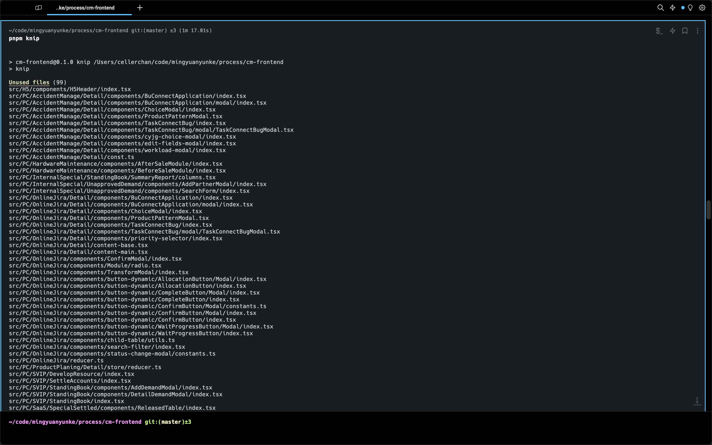
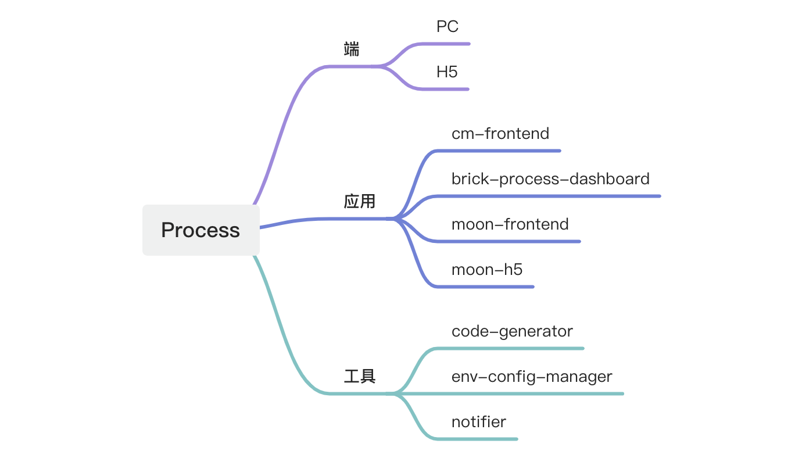
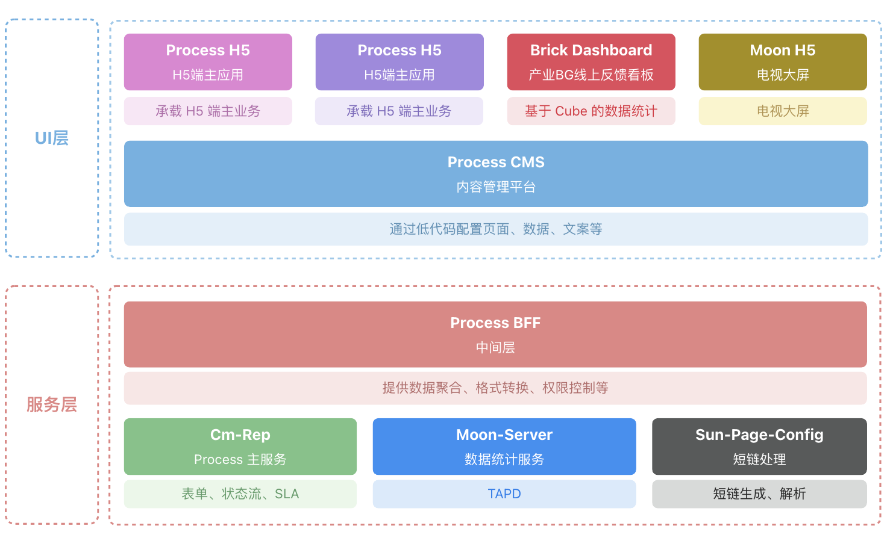
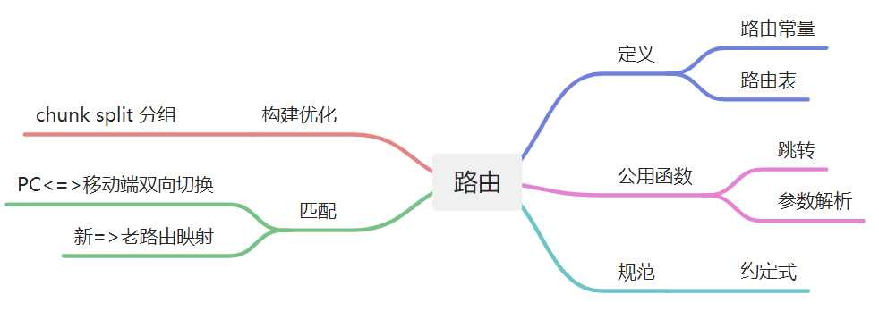
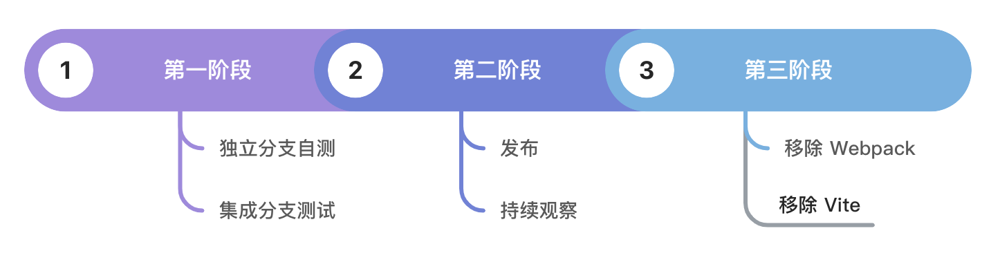
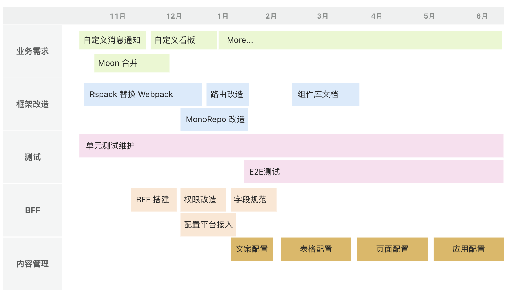
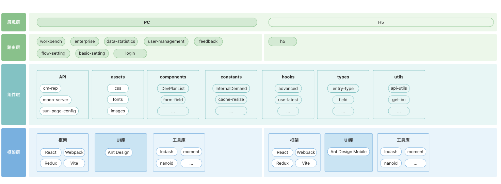

<!-- **最新进度说明：由于 Process 产品已转为维护状态， 此规划推行截止于 2024 年 5 月，但各类改造目标已有雏形，后续如产品规划变更，仍可参考此文档。**

背景
--

当前的 Process 前端应用，在代码量快速增长的情况下，由于一些新老兼容的逻辑处理不到位，以及一些不符合常理的历史逻辑，导致系统不稳定性日趋升高。

**关键词：混元归一**

混元：出自《云笈七籖》，指天地元气，亦指天地/宇宙。

将所有混乱，分散的功能归到一个最小的集合中统一运用，最大程度上减小错误出现的概率。



详细规划
----

下面将会对上面的每一项做详细展开说明。

### 历史债务清除

#### 无用文件的清除

随着自定义表单、自定义工作流，以及后续自定义 SLA、自定义消息通知等需求上线，会废弃掉很多以前在前端代码中写死的逻辑及与之相关的组件/工具类等。

大体方案：使用 [knip](https://github.com/webpro/knip) 工具检查，扫描出无用文件，逐个移除验证。

基础配置：

**knip.ts**

```ts
import type { KnipConfig } from 'knip';
 
const config: KnipConfig = {
    entry: ['src/index.tsx'],
    project: ['src/**/*.tsx', 'src/**/*.ts'],
};
 
export default config;
```

测试效果展示：



#### BU 问题

bu 问题主要涉及的范围为新老模型的兼容，参数传递的规范，路由层面的强制性校验等。

现状：

* 接口参数定义没有统一的标准，不清楚哪些接口需要传递bu，哪些不需要，但后端其实有隐藏的逻辑，很多接口是必须要在 header 中传 bu 的，否则调用会报业务错误
* 在 header 中已经存在 bu 字段的前提下，部分接口参数中仍需要传递 workspace\_code（主要是新模型相关的接口），不免有些功能重复

改进措施：

1. 整理出目前在前端应用中调用的所有后端接口，确认现有的 bu 参数传递方式
2. 与后端约定规范的传递方式，并输出规范文档，对现有调用中不符合规范的写法进行调整
3. 修改所有从路由/localStorage 中获取当前业务线的方式，当进入系统时通过 store 存储到内存中，需要使用时从 store 中获取，保证无论在页面停留多久，无论开了多少个其他标签页，用户对界面的操作永远是所见即所得的。

#### 权限问题

权限问题主要涉及的范围为各问题类型的详情页，包括线上反馈、客户专项、硬件工单等。

在 Process 系统中，详情页是一个特殊的存在，它可以让用户在处于一个业务线时访问其他业务线的详情页数据，但现状是有部分功能在进行判断时，使用的是全局权限（即当前侧边栏的业务线）进行判断的，应该调整为判断如果是详情页，则从详情接口的 detail.auth 中获取权限集合。

需要设计一个通用的上下文环境，在所有使用的地方通过一个统一的 hook 来获取 context 中匹配当前上下文的值。

### Monorepo 改造

现状说明：

如下图，当前 Proces 存在多端、多应用的特点，涉及范围较广，开发不同的模块时往往需要在多个项目、仓库、工作区之间切换，且在 Mars 中需要维护多个产品下应用的各种配置，如流水线、环境变量等，增加了开发时的心智负担，也提升了系统的不稳定性。



在 Monorepo 中，只存在一个仓库，所有的项目都可以在同一个工作区中开发、调试，维护 Mars 多应用多配置的问题也不复存在，可以恰到好处地解决以上问题。

#### 架构初想

新的前后端交互架构：



基于上图对目录结构进行重新设计：

* main PC 端主站点
* h5 h5 端单独打包
* bff BFF 服务，可以与前端应用共享 common 中的常量、类型定义等
* brick-dashboard 积木看板（主要是产业BG的线上反馈看板）
* moon-h5 （主要是大屏上的 Process 看板）
* cms 内容管理平台
* common
  * request 请求适配器，提供对 cm-rep、moon-server、sun-page-config 的统一 API 封装
  * components 通用的组件库
  * components-h5 h5 组件库
  * constants 通用的集合
  * hooks 通用的 hooks 集合
  * services 接口请求的代码，由 code-generator 一键生成
  * utils 通用的工具类
  * types 通用的类型定义
* tools 工具
  * code-generator 接口代码生成工具
  * env-config-manager 本地环境变量管理工具
* config 配置集
  * eslint-config
  * stylelint-config
  * prettier-plugin

#### BFF

前端苦无 BFF 已久。

现有的前后端联调模式，由于各个维度的限制，如后端人手不足、新老模型兼容的大前提下，后端往往无法在接口聚合层面给到前端想要的数据，往往是给到几个零散的接口，然后由前端进行自由组合，按需调用，在交互较为复杂的页面，一个简单的操作可能会调用多个相关的接口，很容易触发浏览器的最大并发限制从而影响页面响应性能。

此时 BFF 应当仁不让。对于 BFF 的期望：

* 接口聚合，减少前端对接口进行聚合的各种丑陋实现，提升页面性能
* 权限控制，对权限点进行重构，通过标识而不再是接口路由来进行权限点控制，提升权限点的可维护性
* 字段格式转换：在前端规范中的变量/常量定义应都是 camelCase，而后端往往使用下划线连接，需要 BFF 承担联调过程中的胶水层工作，给到符合前后端需求的格式

### 工程化

#### 规范工程

规范工程主要包括环境规范、代码规范和 commit 规范三个方面，下面分别展开。

##### 环境规范

在以往的项目中，没有对环境设置的统一规范，存在如下问题：

* Mars 构建流程中，既与 Dockerfile 中定义的构建脚本不一致，也与本地开发的构建流程不一致，如开发安装依赖使用 pnpm，Mars 实际构建时使用 yarn，很容易由于安装的依赖版本不一致导致一些 API 兼容问题，难以排查
* 使用了架构组的构建镜像，无法自定义，比如想要自定义镜像中的 pnpm 版本，需要重新全局安装，并且在每个相似应用中都需要维护一份。

##### 代码规范

通过 ESLint + StyleLint + Prettier + EditorConfig 在 commit 阶段对 staged 状态的代码进行规范性校验，提升标准库中代码的风格一致性并减少通用错误。在经过 Git hooks 的整理重构后，目前已经建立起了比较稳定的规范体系，后续需要完善文档，并考虑将规范性校验加入 CI 流程，做到规范的可持续性。

#### 效率工程

##### 约定式路由改造



当前的系统中存在组织混乱，命名随意等问题，其中很重要的一部分就是路由混乱：

* 页面文件与路由命名相去甚远，难以一一对应
* 新增一个路由需要修改多个文件
* 路由配置散落各处，缺少维护规范
* h5 与 PC 端路由结构不一致，维护成本高

针对以上问题，通过约定式路由改造，我们可以：

* 根据文件目录自动化生成路由表，所见即所得
* 所有需要读取路由的模块通过统一的协议进行获取
* 全局唯一的路由入口
* 配合 Monorepo 改造，分离 PC 与 H5 路由，保持结构一致性，通过 Map 文件进行路由映射

##### Rspack 替换 Webpack

当前构建流程基于 Webpack，在之前已经成功接入过 Vite 支持开发环境调试，但由于碎文件过多造成启动阶段的 ESM 请求数量过大，冷启动的速度反而不如使用了 ESBuild 插件的 Webpack，故目前开发+生产优先使用的构建工具仍然为 Webpack。

字节开源的 Rspack，开发周期即将达到1年，且社区陆续有生产环境接入的案例，反馈良好。

目前的痛点：

* 基于 Webpack + ESBuild 的构建体系在开发模式下对 HMR 的支持不足，修改代码后会触发页面整体刷新，造成开发调试效率较低
* 随着业务代码的快速增加，构建时间变长，每次接测后等待时间久

经过一段时间的预研，发现对于普通项目的 Webpack 配置，Rspack 可以做到 80% 的兼容，开发/生产构建速度可以达到 50% 以上的提升，收益远大于成本，可行。

逐步替换策略：



##### 提供标准输出的接口请求代码生成库

现存的接口请求代码生成主要分两部分：

* 维护在 Middleman 的老接口
* 维护在 Apifox 的新接口，如 SLA 相关接口

对于前者，使用了架构组开发的 openapi-gen-typescript，而对于后者，使用了自己开发的 `@process/code-generator 库`。其中后者已支持了 OpenAPI V2 及 V3 版本。对于两个库的对比如下：

库

openapi-gen-typescript

`@process/code-generator`

优点

* 输出文件统一
* 使用团队多，久经考验

* 自己维护，扩展性强
* 输出体积小，只输出需要的代码

缺点

* 近期维护不佳
* 输出文件体积大

对于 openapi-gen-typescript 最大的问题是维护情况不明，一旦有新功能需要支持可能无法及时响应，故此我们选择在 `@process/code-generator`的基础上继续完善功能，找到合适的时机，统一 Middleman 和 Apifox 的输入输出。

后续规划：

* 接口请求代码通过 npm 包的形式进行快照维护，降低前端构建对后端接口文档的依赖
* 增强对 openapi-v3 的支持
* 统一各种来源的输入输出，降低开发维护成本

#### 质量工程

##### 单元测试

目前已基于 Jest + React Testing Library 搭建了单元测试基础框架，并成功跑通了 4 个 util + component 用例，后续继续完善基础组件+基础工具类的单元测试。

##### E2E 测试

随着业务的逐步发展，对于历史逻辑的修改和扩充越来越频繁，而对于包含许多特殊逻辑的业务页面，单元测试往往是力不从心的，此时需要通过 E2E 测试来保证在进行历史逻辑的修改/重构后，原本的逻辑仍能正常运行。

技术栈：Cypress / PlayWright。

路线图
---



架构现状图：

 -->
