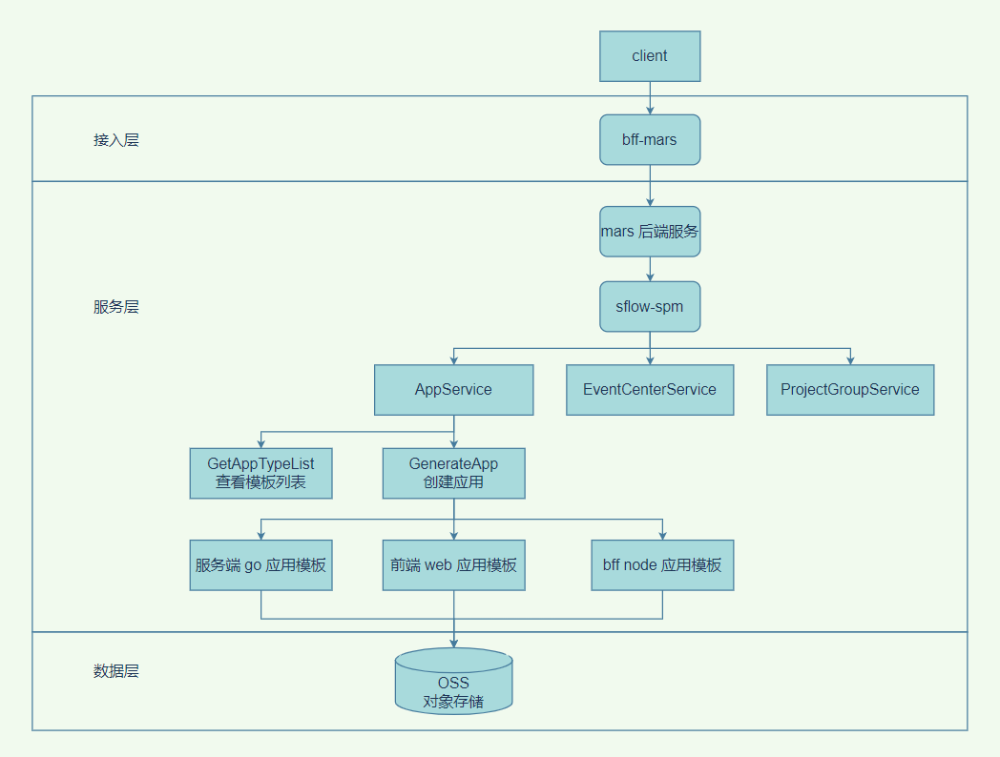

### 需求细化
--------

支持原有模板的基础上，支持前端应用模板。


1. 前端需要提供一个公共的前端 gitlab 账号，并给出前端模板的代码库。

2. 由前端同学罗列出需要建立的前端模板类型。

3. 前端同学提出，需要按分支来划分不同模板，需要后端同学支持**从模板仓库分支获取所需模板**。

4. 前端模版只需要替换 package.json 中的 name 字段（web-example)，同 bff 模板。

    **一级名称**

    * web

    **二级名称**

    * yunke-back

    * h5

    * npm-package-node

    * npm-package-browser

1. 调试代码库：git仓库

1. 调试分支：h5

### 上下游关系
---------



业务流程：

1. mars 新增应用/仓库初始化，通过 sflow-spm 服务的 GetAppTypeList 接口展示所有模板类型

2. 用户选择应用类型 Client、模板类型前端模板，然后走完新增流程

3. 最后确认时，会走 sflow-spm 的 GenerateApp 接口

4. GenerateApp 接口会把对应的模板创建好，放在云对象存储 OSS 上

5. mars 执行新增应用流程会到 OSS 上找到应用对应的模板拷贝下来，生成 git 仓库

### 表结构关系
---------

#### app\_type

```sql
CREATE TABLE `app_type` (
  `id` int(11) unsigned NOT NULL AUTO_INCREMENT COMMENT 'ID',
  `name` varchar(64) NOT NULL DEFAULT '' COMMENT '应用类型名称',
  `description` varchar(64) NOT NULL DEFAULT '' COMMENT '应用类型说明',
  `is_del` tinyint(3) unsigned NOT NULL DEFAULT '0' COMMENT '是否删除：0.未删除，1.已删除',
  `deleted_time` int(10) unsigned NOT NULL DEFAULT '0' COMMENT '删除时间',
  `create_time` int(10) unsigned NOT NULL DEFAULT '0' COMMENT '创建时间',
  `modify_time` int(10) unsigned NOT NULL DEFAULT '0' COMMENT '更新时间',
  PRIMARY KEY (`id`)
) ENGINE=InnoDB DEFAULT CHARSET=utf8mb4 COMMENT='应用类型表';
```

#### template\_first\_category

```sql
CREATE TABLE `template_first_category` (
  `id` int(11) unsigned NOT NULL AUTO_INCREMENT COMMENT 'ID',
  `name` varchar(64) NOT NULL DEFAULT '' COMMENT '一级模板目录名称',
  `description` varchar(64) NOT NULL DEFAULT '' COMMENT '一级模板目录说明',
  `is_del` tinyint(3) unsigned NOT NULL DEFAULT '0' COMMENT '是否删除：0.未删除，1.已删除',
  `deleted_time` int(10) unsigned NOT NULL DEFAULT '0' COMMENT '删除时间',
  `create_time` int(10) unsigned NOT NULL DEFAULT '0' COMMENT '创建时间',
  `modify_time` int(10) unsigned NOT NULL DEFAULT '0' COMMENT '更新时间',
  PRIMARY KEY (`id`)
) ENGINE=InnoDB DEFAULT CHARSET=utf8mb4 COMMENT='应用模板一级目录表';
```

#### template\_second\_category

```sql
CREATE TABLE `template_second_category` (
  `id` int(11) unsigned NOT NULL AUTO_INCREMENT COMMENT 'ID',
  `name` varchar(64) NOT NULL DEFAULT '' COMMENT '二级模板目录名称',
  `description` varchar(64) NOT NULL DEFAULT '' COMMENT '二级模板目录说明',
  `is_del` tinyint(3) unsigned NOT NULL DEFAULT '0' COMMENT '是否删除：0.未删除，1.已删除',
  `deleted_time` int(10) unsigned NOT NULL DEFAULT '0' COMMENT '删除时间',
  `create_time` int(10) unsigned NOT NULL DEFAULT '0' COMMENT '创建时间',
  `modify_time` int(10) unsigned NOT NULL DEFAULT '0' COMMENT '更新时间',
  PRIMARY KEY (`id`)
) ENGINE=InnoDB DEFAULT CHARSET=utf8mb4 COMMENT='应用模板二级目录表';
```

#### type\_categories

```sql

CREATE TABLE `type_categories` (
  `id` int(11) unsigned NOT NULL AUTO_INCREMENT COMMENT 'ID',
  `app_type_id` int(11) unsigned NOT NULL COMMENT '应用类型 ID',
  `first_category_id` int(11) unsigned NOT NULL COMMENT '应用模板一级目录 ID',
  `second_category_id` int(11) unsigned NOT NULL COMMENT '应用模板二级目录 ID',
  `is_del` tinyint(3) unsigned NOT NULL DEFAULT '0' COMMENT '是否删除：0.未删除，1.已删除',
  `deleted_time` int(10) unsigned NOT NULL DEFAULT '0' COMMENT '删除时间',
  `create_time` int(10) unsigned NOT NULL DEFAULT '0' COMMENT '创建时间',
  `modify_time` int(10) unsigned NOT NULL DEFAULT '0' COMMENT '更新时间',
  PRIMARY KEY (`id`)
) ENGINE=InnoDB DEFAULT CHARSET=utf8mb4 COMMENT='应用类型与多级应用模板目录关联表';
```

应用类型：

1. Server

2. BFF

3. Client

模板类型：

1. Go

    1. Grpc

    2. Cron

    3. Task

    4. Http

    5. Tcp

    6. Gin

2. Node

    1. App

### 方案
------

主要逻辑：

1. 用户选择指定前端模板，进入 GenerateApp 接口

2. 将前端模板代码库指定分支下的仓库内容拷贝到本地

3. 将 package.json 中 web-example 替换为项目名

4. 将本地项目压缩成 zip 文件

5. 将 zip 文件上传到 oss
